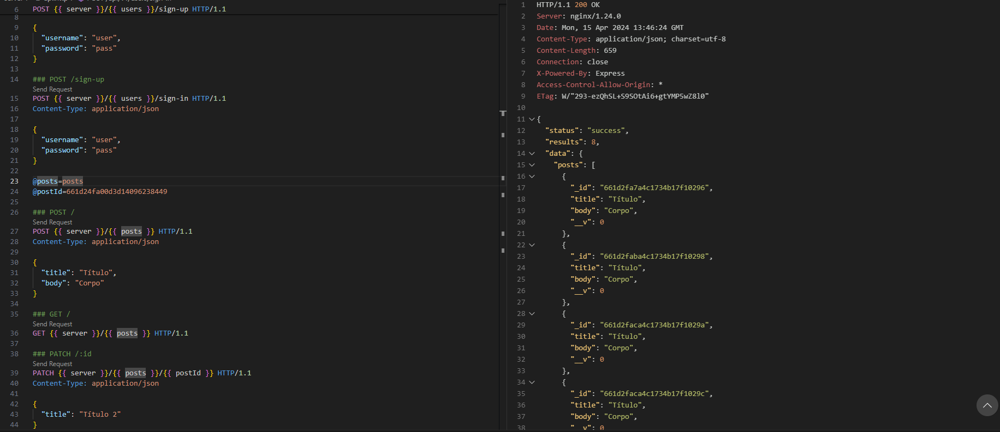

Applications developed in Docker, Express, Mongo and React

> :fire: Development

```
  make run-dev
  make stop-containers
  make down-dev
  make clear-server
  make clear-web
  make clear-volumes
  make server-logs
  make server-bash
  make mongo-bash
  make web-bash
```

> :fire: Local

```
  make run-local
  make scale-local
  make down-local
  make swarm-local
  make leave-swarm
```

> :fire: Production

```
  make run-prod
```

> :gear: Environment Variables

- User mongo: MONGO_INITDB_ROOT_USERNAME `mongo`
- Pass mongo: MONGO_INITDB_ROOT_PASSWORD `mongo`
- Environment: NODE_ENV `server`
- Server port: PORT `server`
- User mongo: MONGO_USER `server`
- Pass mongo: MONGO_PASS `server`
- Database mongo: MONGO_DB `server`
- Server URL: SERVER_URL `web`

> :thought_balloon: `Higor Eduardo Docs`


